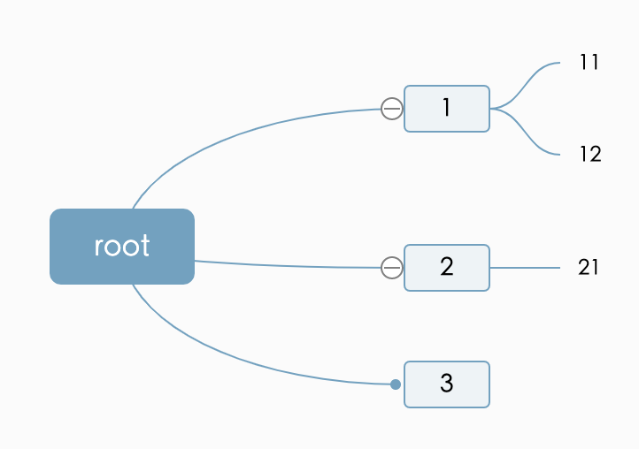

# Std UI（Standard UI）


## 简介

Std UI 是一套用 JSON 描述 UI 的解决方案。设计这套解决方案的目的是：

* 提供一个平台无关、框架无关的静态 UI 描述标准。
* 一套代码，多端渲染。
* 支持多种布局方式，告别绝对布局，轻松设计界面。
* 为不同的 UI 设计语言和工具提供一个中间层转换工具，便于相互转换。

目前版本是 v0.1.0。


## 快速开始

比如在一个 300 x 300 的黑色画布中间，绘制一个 100 x 100 的红色矩形：

```json
{
    "_type": "root",
    "width": 300,
    "height": 300,
    "color": "#000",
    "_children": [
        {
            "_type": "rect",
            "x": 100,
            "y": 100,
            "width": 100,
            "height": 100,
            "color": "#f00"
        }
    ]
}
```


## 规范

在这里可以查看[标准规范](docs/std.md)


## 使用

转成 SVG 代码。

```js
import { StdUI } from '@yunser/ui-std/dist/svg'

console.log(StdUI.toSvg({
    root: {
        "_type": "root",
        "width": 300,
        "height": 300,
        "color": "#fff",
        "_children": [
            {
                "_type": "rect",
                "x": 100,
                "y": 100,
                "width": 100,
                "height": 100,
                "color": "#f00"
            }
        ]
    }
}))
```


## Std Mind Map（Standard Mind Map）

脑图模块是基于 Std UI 的脑图拓展，致力于提供统一的脑图规范。

比如，我们可以构建这样的 JSON 数据：

```json
{
    "_type": "mind",
    "root": {
        "_text": "root",
        "_children": [
            {
                "_type": "node",
                "_text": "1",
                "_children": [
                    {
                        "_type": "node",
                        "_text": "11"
                    },
                    {
                        "_type": "node",
                        "_text": "12"
                    }   
                ]
            },
            {
                "_type": "node",
                "_text": "2",
                "_children": [
                    {
                        "_type": "node",
                        "_text": "21"
                    }   
                ]
            },
            {
                "_type": "node",
                "_text": "3"
            }
        ]
    }
}
```

渲染效果如下：



使用代码转换格式：

```js
import { MindMap } from '@yunser/ui-std/dist/mindMap'
import * as fs from 'fs'

const root = {
    "_type": "node",
    "_text": "root",
    "_children": [
        {
            "_type": "node",
            "_text": "1",
            "_children": [
                {
                    "_type": "node",
                    "_text": "11"
                },
                {
                    "_type": "node",
                    "_text": "12"
                }
            ]
        },
        {
            "_type": "node",
            "_text": "2",
            "_children": [
                {
                    "_type": "node",
                    "_text": "21"
                }
            ]
        },
        {
            "_type": "node",
            "_text": "3"
        }
    ]
}
const mindMap = new MindMap({
    root
})

// 转成百度脑图格式
const kmContent = mindMap.toKityMinder()
console.log('content', kmContent)
fs.writeFileSync('out.km', kmContent, 'utf8')

// 转成 FreeMind 格式
const mmContent = mindMap.toFreeMind()
console.log('content', mmContent)
fs.writeFileSync('out.mm', mmContent, 'utf8')

// 转成 ProcessOn 格式
const posContent = mindMap.toProcessOn()
console.log('content', posContent)
fs.writeFileSync('out.pos', posContent, 'utf8')
```

导入思维导图

```js
// 导入百度脑图
const mindMap = new MindMap()
const kmData = fs.readFileSync('res/root.km', 'utf8')
mindMap.fromKityMinder(kmData)
```


## Std Doc（Standard Document）

Std Doc 规范用于统一富文本。

构建 JSON 如下：

```json
{
    "_type": "doc",
    "version": "0.0.1",
    "_children": [
        {
            "_type": "h1",
            "_text": "一级标题"
        },
        {
            "_type": "p",
            "_text": "这是第一段"
        },
        {
            "_type": "p",
            "_text": "这是第二段"
        },
    ]
}
```

使用：

```js
import { Doc } from '@yunser/ui-std/dist/doc'
import * as fs from 'fs'

const content = [
    {
        "_type": "h1",
        "_text": "一级标题"
    },
    {
        "_type": "h2",
        "_text": "二级标题"
    },
    {
        "_type": "p",
        "_text": "这是第一段"
    },
    {
        "_type": "p",
        "_text": "这是第二段"
    },
    {
        "_type": "h2",
        "_text": "二级标题"
    },
    {
        "_type": "p",
        "_text": "这是第三段"
    },
    {
        "_type": "image",
        "url": "https://icons.yunser.com/icons/app.png",
        "width": 100,
        "height": 100
    }
]
let doc = new Doc({
    content,
})

fs.writeFileSync('out/doc.md', doc.toMarkdown(), 'utf8')

```

## Std Graph（Standard）

Std Graph 用于统一流程图规范。和 Std UI 不同的是，Std Graph 并不追求全平台的 UI 一致性，更关注的是功能的一致性。

构建 JSON 如下：

```json
{
    "_type": "graph",
    "version": "0.0.1",
    "width": 400,
    "height": 400,
    "_children": [
        {
            "_type": "rect",
            "x": 100,
            "y": 100,
            "width": 100,
            "height": 100,
            "color": "#f00",
            "_text": "开始"
        }
    ]
}
```


## 开发测试

```
ts-node test3.ts
```


## 相关项目

* [figma-json](https://github.com/yunser/figma-json)
