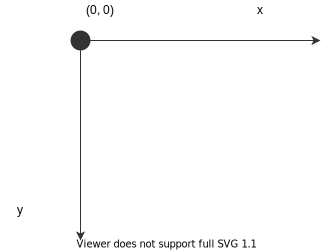

## 标准规范

坐标系：



采用绝对坐标。

矩形（rect）

```json
{
    "_type": "rect",
    "x": 300,
    "y": 300,
    "width": 300,
    "height": 300
}
```

圆形（circle）

```json
{
    "_type": "circle",
    "cx": 300,
    "cy": 300,
    "radius": 50
}
```

直线（rect）

```json
{
    "_type": "line",
    "x1": 0,
    "y1": 0,
    "x2": 100,
    "y2": 0
}
```

文本（text）

```json
{
    "_type": "text",
    "x": 0,
    "y": 0,
    "text": "hello",
    "textSize": 16
}
```

多边形（polygon）

```json
{
    "_type": "polygon",
    "points": [
        {
            "x": 50,
            "y": 100,
        },
        {
            "x": 0,
            "y": 200,
        },
        {
            "x": 100,
            "y": 200,
        }
    ]
}
```

填充（color）

支持 `#ffffff` 或 `#fff` 格式的颜色表示。

```json
{
    "_type": "rect",
    "x": 300,
    "y": 300,
    "width": 300,
    "height": 300,
    "color": "#f00"
}
```

描边（border）

```json
{
    "_type": "rect",
    "x": 300,
    "y": 300,
    "width": 300,
    "height": 300,
    "border": {
        "color": "#000",
        "width": 1
    }
}
```
